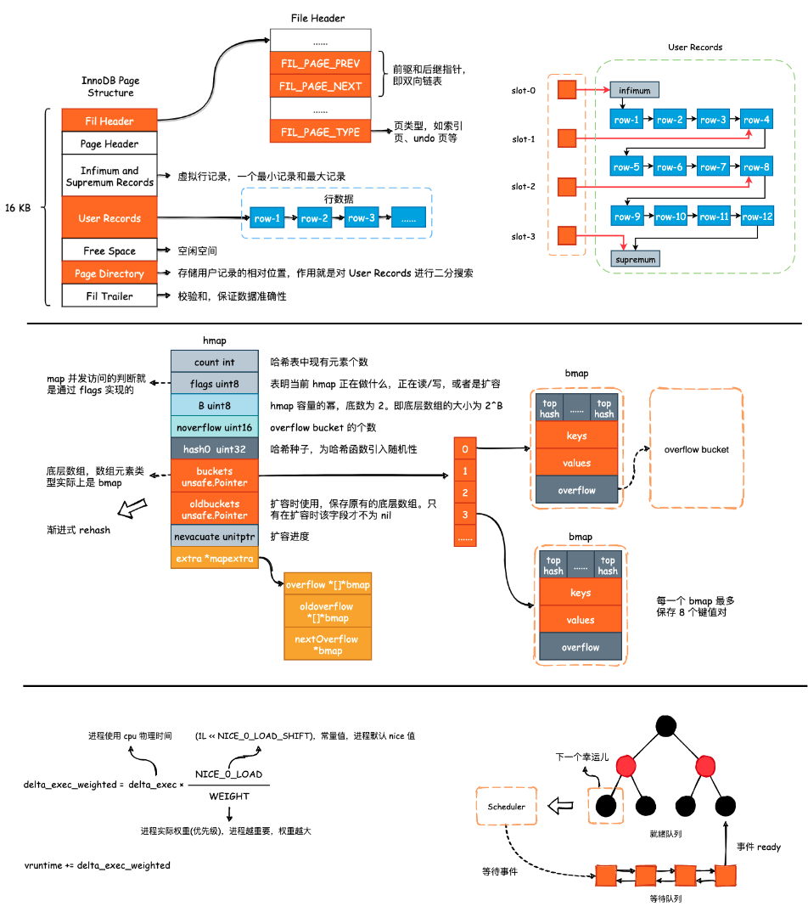

# Psyduck

另一个用 XMind 记录 CS 基础问题的地方，同样提供了 `.xmind` 源文件以及导出的 `.pdf` 文件，XMind 版本为「XMind 2020」。

在 2020 年时，曾花了约 2 个月的时间整理了第一份 XMind 知识库: [ZeroMind](https://github.com/SmartKeyerror/ZeroMind)。
之所以额外创建一个 Repo 干同样的事情，是因为一方面自己的审美发生了变化，另一方面则是对那些最重要但基础的问题有了更深刻地理解。

温故而知新，孔子诚不欺我。在整理面试题目的过程中，对诸如 CFS-vruntime、POSIX 条件变量、TCP 和 epoll 等内容有了自己的理解：不再是死记硬背了。

之所以使用 XMind 来记录这些内容，是因为我非常喜欢《火星救援》里面的一句台词:

> 有时候，所有的情况都会对你不利。所有的坏事一起发生，你就可能会想，就是这样了，这就是我的终点了。面对这种情况，你要么接受，要么想办法解决，这就是一切的真谛。解决问题，你想各种办法，解决一个问题，然后接着解决下一个问题，循环往复，等你解决了足够多的问题，你就可以回家了。

即学会分解。下面是一些图片，可以帮助你更好地了解这个项目做了什么:

------

## :high_brightness: 目录

- [Database](#bento-Database)
- [Linux Network Programing](#fire-Linux-Network-Programing)
- [Golang](#paw_prints-Golang)
- [C++](#telescope-C++)

------

## :bento: Database

- [为什么 MySQL 使用 B+Tree?](https://smartkeyerror.oss-cn-shenzhen.aliyuncs.com/Phyduck/database/%E4%B8%BA%E4%BB%80%E4%B9%88MySQL%E4%BD%BF%E7%94%A8B%2BTree.pdf)
- [InnoDB 数据页结构](https://smartkeyerror.oss-cn-shenzhen.aliyuncs.com/Phyduck/database/InnoDB-Page.pdf)
- [深入浅出 InnoDB Index](https://smartkeyerror.oss-cn-shenzhen.aliyuncs.com/Phyduck/database/%E6%B7%B1%E5%85%A5%E6%B5%85%E5%87%BA%20InnoDB%20Index.pdf)
- [InnoDB WAL](https://smartkeyerror.oss-cn-shenzhen.aliyuncs.com/Phyduck/database/InnoDB-WAL.pdf)
- [InnoDB undo log 与 MVCC](https://smartkeyerror.oss-cn-shenzhen.aliyuncs.com/Phyduck/database/InnoDB-undo-log%E4%B8%8EMVCC.pdf)
- [Redis 数据结构](https://smartkeyerror.oss-cn-shenzhen.aliyuncs.com/Phyduck/database/Redis%E6%95%B0%E6%8D%AE%E7%BB%93%E6%9E%84.pdf)
- [etcd 概述](https://smartkeyerror.oss-cn-shenzhen.aliyuncs.com/Phyduck/database/etcd%E6%A6%82%E8%BF%B0.pdf)

------

## :fire: Linux-Network-Programing

- [信号](https://smartkeyerror.oss-cn-shenzhen.aliyuncs.com/Phyduck/linux-network/%E4%BF%A1%E5%8F%B7.pdf)
- [信号集与信号掩码](https://smartkeyerror.oss-cn-shenzhen.aliyuncs.com/Phyduck/linux-network/%E4%BF%A1%E5%8F%B7%E9%9B%86%E4%B8%8E%E4%BF%A1%E5%8F%B7%E6%8E%A9%E7%A0%81.pdf)
- [进程的创建](https://smartkeyerror.oss-cn-shenzhen.aliyuncs.com/Phyduck/linux-network/%E8%BF%9B%E7%A8%8B%E7%9A%84%E5%88%9B%E5%BB%BA.pdf)
- [进程间通讯简介](https://smartkeyerror.oss-cn-shenzhen.aliyuncs.com/Phyduck/linux-network/%E8%BF%9B%E7%A8%8B%E9%97%B4%E9%80%9A%E8%AE%AF%E7%AE%80%E4%BB%8B.pdf)
- [DAEMON](https://smartkeyerror.oss-cn-shenzhen.aliyuncs.com/Phyduck/linux-network/DAEMON.pdf)
- [可靠数据传输协议——TCP](https://smartkeyerror.oss-cn-shenzhen.aliyuncs.com/Phyduck/linux-network/%E5%8F%AF%E9%9D%A0%E4%BC%A0%E8%BE%93%E5%8D%8F%E8%AE%AE%E2%80%94TCP.pdf)
- [TCP 拥塞控制](https://smartkeyerror.oss-cn-shenzhen.aliyuncs.com/Phyduck/linux-network/TCP%E6%8B%A5%E5%A1%9E%E6%8E%A7%E5%88%B6.pdf)
- [socket 编程问题一览(01)](https://smartkeyerror.oss-cn-shenzhen.aliyuncs.com/Phyduck/linux-network/socket%20%E7%BC%96%E7%A8%8B%E9%97%AE%E9%A2%98%E4%B8%80%E8%A7%88%2801%29.pdf)
- [socket 编程问题一览(02)](https://smartkeyerror.oss-cn-shenzhen.aliyuncs.com/Phyduck/linux-network/socket%20%E7%BC%96%E7%A8%8B%E9%97%AE%E9%A2%98%E4%B8%80%E8%A7%88%2802%29.pdf)
- [epoll 原理剖析](https://smartkeyerror.oss-cn-shenzhen.aliyuncs.com/Phyduck/linux-network/epoll%20%E5%8E%9F%E7%90%86%E5%89%96%E6%9E%90.pdf)
- epoll_event
- [HTTPS 握手过程](https://smartkeyerror.oss-cn-shenzhen.aliyuncs.com/Phyduck/linux-network/HTTPS.pdf)

------

## :paw_prints: Golang

- [channel 的设计与使用](https://smartkeyerror.oss-cn-shenzhen.aliyuncs.com/Phyduck/golang/channel.pdf)
- [map 的设计与扩容时机](https://smartkeyerror.oss-cn-shenzhen.aliyuncs.com/Phyduck/golang/map.pdf)
- [G-M-P 模型](https://smartkeyerror.oss-cn-shenzhen.aliyuncs.com/Phyduck/golang/G-M-P%E6%A8%A1%E5%9E%8B.pdf)
- [三色标记-清除式 GC](https://smartkeyerror.oss-cn-shenzhen.aliyuncs.com/Phyduck/golang/GC.pdf)

------

## :telescope: C++

#### common

- [const](https://smartkeyerror.oss-cn-shenzhen.aliyuncs.com/Phyduck/c%2B%2B/common/1.%20const.pdf)

#### 面向对象程序设计

TODO

#### 拷贝控制

- [拷贝构造与拷贝赋值](https://smartkeyerror.oss-cn-shenzhen.aliyuncs.com/Phyduck/c%2B%2B/copy-control/1.%20%E6%8B%B7%E8%B4%9D%E6%9E%84%E9%80%A0%E4%B8%8E%E6%8B%B7%E8%B4%9D%E8%B5%8B%E5%80%BC.pdf)
- [左值与右值](https://smartkeyerror.oss-cn-shenzhen.aliyuncs.com/Phyduck/c%2B%2B/copy-control/2.%20%E5%B7%A6%E5%80%BC%E4%B8%8E%E5%8F%B3%E5%80%BC.pdf)
- [移动构造与移动赋值](https://smartkeyerror.oss-cn-shenzhen.aliyuncs.com/Phyduck/c%2B%2B/copy-control/3.%20%E7%A7%BB%E5%8A%A8%E6%9E%84%E9%80%A0%E4%B8%8E%E7%A7%BB%E5%8A%A8%E8%B5%8B%E5%80%BC.pdf)
- [三/五法则](https://smartkeyerror.oss-cn-shenzhen.aliyuncs.com/Phyduck/c%2B%2B/copy-control/4.%20%E4%B8%89%E4%BA%94%E6%B3%95%E5%88%99.pdf)

#### 模板与泛型编程

- [Template 的基本使用](https://smartkeyerror.oss-cn-shenzhen.aliyuncs.com/Phyduck/c%2B%2B/template/1.%20Template.pdf)
- [万能引用与类型推断问题](https://smartkeyerror.oss-cn-shenzhen.aliyuncs.com/Phyduck/c%2B%2B/template/2.%20%E4%B8%87%E8%83%BD%E5%BC%95%E7%94%A8%E4%B8%8E%E7%B1%BB%E5%9E%8B%E6%8E%A8%E6%96%AD%E9%97%AE%E9%A2%98.pdf)
- [完美转发](https://smartkeyerror.oss-cn-shenzhen.aliyuncs.com/Phyduck/c%2B%2B/template/3.%20%E5%AE%8C%E7%BE%8E%E8%BD%AC%E5%8F%91.pdf)

#### 类型相关

- [强制类型转换](https://smartkeyerror.oss-cn-shenzhen.aliyuncs.com/Phyduck/c%2B%2B/type/1.%20%E5%BC%BA%E5%88%B6%E7%B1%BB%E5%9E%8B%E8%BD%AC%E6%8D%A2.pdf)
- [自动类型推断（auto）](https://smartkeyerror.oss-cn-shenzhen.aliyuncs.com/Phyduck/c%2B%2B/type/2.%20%E8%87%AA%E5%8A%A8%E7%B1%BB%E5%9E%8B%E6%8E%A8%E6%96%AD%EF%BC%88auto%EF%BC%89.pdf)
- [decltype](https://smartkeyerror.oss-cn-shenzhen.aliyuncs.com/Phyduck/c%2B%2B/type/3.%20decltype.pdf)

#### 函数编程

- [lambda 表达式](https://smartkeyerror.oss-cn-shenzhen.aliyuncs.com/Phyduck/c%2B%2B/functional/1.%20lambda%20%E8%A1%A8%E8%BE%BE%E5%BC%8F.pdf)
- [可调用对象——std::function](https://smartkeyerror.oss-cn-shenzhen.aliyuncs.com/Phyduck/c%2B%2B/functional/2.%20%E5%8F%AF%E8%B0%83%E7%94%A8%E5%AF%B9%E8%B1%A1%20function.pdf)

#### 智能指针

- [堆、栈与 RAII: C++ 管理资源的方式](https://smartkeyerror.oss-cn-shenzhen.aliyuncs.com/Phyduck/c%2B%2B/smart-ptr/1.%20%E5%A0%86%E3%80%81%E6%A0%88%E4%B8%8E%20RAII%20%3A%20C%2B%2B%20%E7%AE%A1%E7%90%86%E8%B5%84%E6%BA%90%E7%9A%84%E6%96%B9%E5%BC%8F.pdf)
- [RAII 与智能指针](https://smartkeyerror.oss-cn-shenzhen.aliyuncs.com/Phyduck/c%2B%2B/smart-ptr/2.%20RAII%E4%B8%8E%E6%99%BA%E8%83%BD%E6%8C%87%E9%92%88.pdf)
- [shared_ptr](https://smartkeyerror.oss-cn-shenzhen.aliyuncs.com/Phyduck/c%2B%2B/smart-ptr/3.%20shared_ptr.pdf)

#### 并发编程

- [Linux 进程、线程与调度](https://smartkeyerror.oss-cn-shenzhen.aliyuncs.com/Phyduck/c%2B%2B/concurrent/1.%20Linux%20%E8%BF%9B%E7%A8%8B%E3%80%81%E7%BA%BF%E7%A8%8B%E4%B8%8E%E8%B0%83%E5%BA%A6.pdf)
- [线程的创建与执行](https://smartkeyerror.oss-cn-shenzhen.aliyuncs.com/Phyduck/c%2B%2B/concurrent/2.%20%E7%BA%BF%E7%A8%8B%E7%9A%84%E5%88%9B%E5%BB%BA%E4%B8%8E%E6%89%A7%E8%A1%8C.pdf)
- [std::async 与 std::future](https://smartkeyerror.oss-cn-shenzhen.aliyuncs.com/Phyduck/c%2B%2B/concurrent/3.%20async%E4%B8%8Efuture.pdf)
- [互斥量与 std::lock_guard、std::unique_lock](https://smartkeyerror.oss-cn-shenzhen.aliyuncs.com/Phyduck/c%2B%2B/concurrent/4.%20%E4%BA%92%E6%96%A5%E9%87%8F%E3%80%81lock_guard%E4%B8%8Eunique_lock.pdf)
- [通知状态的改变——POSIX 条件变量](https://smartkeyerror.oss-cn-shenzhen.aliyuncs.com/Phyduck/c%2B%2B/concurrent/5.%20%E9%80%9A%E7%9F%A5%E7%8A%B6%E6%80%81%E7%9A%84%E6%94%B9%E5%8F%98%E2%80%94POSIX%E6%9D%A1%E4%BB%B6%E5%8F%98%E9%87%8F.pdf)
- [通知状态的改变——C++ 条件变量](https://smartkeyerror.oss-cn-shenzhen.aliyuncs.com/Phyduck/c%2B%2B/concurrent/6.%20%E9%80%9A%E7%9F%A5%E7%8A%B6%E6%80%81%E7%9A%84%E6%94%B9%E5%8F%98%E2%80%94C%2B%2B%E6%9D%A1%E4%BB%B6%E5%8F%98%E9%87%8F.pdf)
- [POSIX 信号量](https://smartkeyerror.oss-cn-shenzhen.aliyuncs.com/Phyduck/c%2B%2B/concurrent/7.%20POSIX%20%E4%BF%A1%E5%8F%B7%E9%87%8F.pdf)

#### 编译与链接

- [编译与链接](https://smartkeyerror.oss-cn-shenzhen.aliyuncs.com/Phyduck/c%2B%2B/compile/1.%20%E7%BC%96%E8%AF%91%E4%B8%8E%E9%93%BE%E6%8E%A5.pdf)

------

