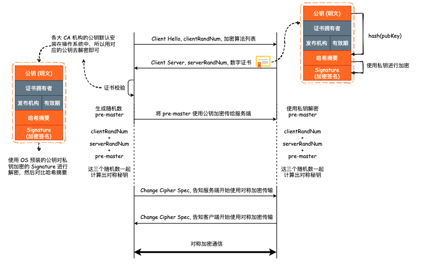

## HTTP 与 HTTPS 有哪些区别？

1. 监听端口不同，HTTP 监听 80 端口，HTTPS 监听 443 端口。
2. HTTP 使用明文传输，在传输用户数据、支付数据等信息时很容易被窃听。HTTPS 则是建立在 SSL/TSL 之上的安全 HTTP 协议，通信数据均使用非对称加密/对称加密算法进行加密，数据在网络上传输更安全。
3. 因为 HTTPS 需要对数据进行加密/解密，所以其实际运行效率要低于 HTTP 协议本身。并且 HTTPS 除了标准的 TCP 三次握手以外，还需要额外的四次 TLS 握手，建立连接需要花费更多时间。

### TLS 握手过程

1. 客户端向服务端发送 Client Hello，并将自身支持的 TLS/SSL 协议版本号、支持的加密算法以及生成的随机字数 `clientRandNum` 一起发送给服务端。
2. 服务端在收到 Client Hello 以后，向客户端发送 Server Hello，并携带**特定**的协议版本、加密算法以及服务端生成的随机数 `serverRandNum`、数字证书发送给客户端。
3. 客户端收到 Server Hello 数据包以后，首先验证证书的有效性。例如证书是否过期、域名是否正确、证书拥有者是否正确等等，并且还会使用预装的 CA 公钥去解密证书中包含的签名(Signature)，并与证书中的哈希摘要进行比对。验证成功后则再次生成一个随机字符串 `pre-master`， 即 Pre Master Secret，预主密钥，通过公钥进行加密，发送给服务端。服务端使用自己的私钥对其进行解密。
4. 而后，客户端与服务端使用前面的 `clientRandNum`，`serverRandNum` 以及 `pre-master` 这三个随机数生成对称加密密钥，后续所有的数据交互均使用该密钥进行对称加密通信。

TODO: 下面儿图中的 Client Server 有误，应修正为 Server Hello

