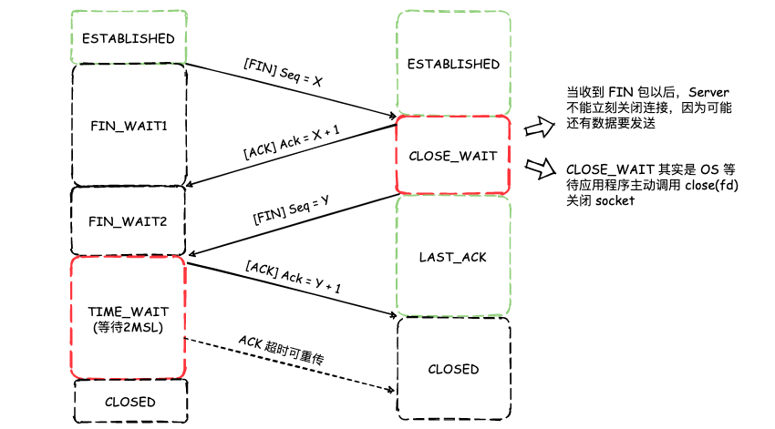

## 简述 TCP 三次握手以及四次挥手的流程。为什么需要三次握手以及四次挥手？

### 三次握手

> 关键点: 双方交换 Seq、MSS 以及 Win 等信息，Server 使用两个队列存储半连接和全连接

1. 客户端向服务端发送带有 SYN 标志位以及一个随机的 Seq 序列号（X）的 TCP 数据包，并将自己的 MSS大小、接收窗口大小（Win）一并放入数据包内，请求建立连接（SYN 的含义其实就是 Synchronize，表示同步）。当发送完 SYN 包以后，客户端的 socket 状态由 `CLOSED` 转变为 `SYN_SENT`。
2. 服务端在收到客户端发来的 SYN 包以后，生成带有 SYN + ACK 标志的数据包，设置 Ack 确认号为 Seq + 1，并生成一个随机的 Seq 序列号（Y），与服务端 MSS大小、接收窗口大小（Win）一起添加至该数据包内，回送至客户端。当发送完 SYN + ACK 标志的 TCP 数据包以后，服务端 scoket 状态由 `LISTEEN` 转换为 `SYN_RECV`。
3. 客户端收到服务端发送的 SYN + ACK 数据包以后，需要回复确认包。即发送一个带有 ACK 标志位的数据包，此时 Seq 序列号为 X + 1，Ack 确认号为 Y + 1，客户端 socket 状态由 `SYN_SENT` 更新为 `ESTABLISHED`，对于客户端而言，TCP 连接已建立。当服务端收该确认包以后，socket 状态由 `SYN_RECV` 更新为 `ESTABLISHED`，表示连接已建立。

对于服务端而言，状态为 `SYN_RECV` 的 TCP 连接通常称为“半连接”，保存在监听队列中的未完成连接队列中。当收到了客户端的 ACK 确认包以后，状态更新至 `ESTABLISHED`，将连接从未完成连接队列中移动至已完成连接队列。`accept()` 函数中的 `backlog` 参数即为已完成连接队列的最大长度。

三次握手的意义:

1. 客户端与服务端确认双方可达，并且能够使用 TCP 协议传输消息。
2. 交换双方的 MSS、Win 大小，为 TCP 拥塞控制提供基础数据，尽最大可能地确保数据包不会丢失。

### 四次挥手

> 关键点: 双方都要有关闭连接的意向，就跟分手似的。一个人说分手，另一个人得问清楚为什么，还得花时间消化这个消息，然后才能说分手。TIME_WAIT 和 CLOSE_WAIT 两个状态比较关键

1. 客户端（通常）准备关闭 TCP 连接，向服务端发送带有 FIN 标志位的数据包，状态由 `ESTABLISHED` 更新至 `FIN_WAIT1`。
2. 服务端收到 FIN 包以后，回复 Ack 确认包，状态由 `EATALISHED` 更新为 `CLOSE_WAIT`，应用程序此时仍然可以发送数据给客户端，并进行清理工作。客户端在收到 ACK 确认包以后，状态由 `FIN_WAIT1` 更新为 `FIN_WAIT2`。
3. 内核等待应用程序调用 `close(fd)` 关闭套接字，当应用程序关闭套接字以后，内核发送带有 FIN 标志位的数据包给客户端，表示服务端关闭连接。状态由 `CLOSE_WAIT` 更新至 `LAST_ACK`，表示等待客户端的最后一个 ACK 确认包。
4. 客户端收到 FIN 包以后，回送 ACK 确认包，状态由 `FIN_WAIT2`更新至 `TIME_WAIT`，等待 2MSL 后完全关闭该 socket。服务端收到 ACK 确认包以后，完全关闭 socket。

四次挥手的意义:

1. 确保 TCP 连接完全拆除，客户端与服务端各发送一次连接关闭请求与连接关闭确认包。
2. 当服务端收到 FIN 包时，可能仍有数据未发送完毕，需要继续发送，所以此时只能回送一个 ACK 确认包。等到所有数据均发送完毕，服务端没有其它动作需要执行了，主动调 `close(fd)` 方法关闭 socket，服务端发送 FIN 包。也就是说，第二次挥手和第三次挥手不能合并。