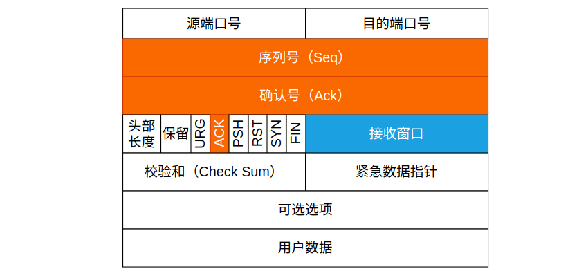

## TCP 怎么保证可靠传输？

首先我们来看 TCP 数据包的结构:

其中序列号（Seq），确认号（Ack），ACK 标志以及接收窗口都是用来实现 TCP 可靠传输的组成之一。

1. **序列号保证数据传输的有序性**。TCP 协议会为每一个发出的数据包进行编号，这个编号就是序列号 Seq，Seq 的增长规则为 `Seq = Seq + 数据字节长度`。当网络出现抖动或者延迟导致 TCP 数据包乱序到达服务端时，服务端会根据 Seq 的大小进行排序，保证数据的连续性。
2. **确认号 Ack + 标志位 ACK 保证对方已收到 Ack 之前的所有数据包**。当接收方收到了 Seq 为 X 的数据包，并且 X 之前的所有数据包均已收到后，接收方将回送 ACK 确认号，以告知对方数据已收到。如果某些数据包丢失，TCP 会根据 Seq 号感知到，此时也会通过 Ack 确认号让对方重新发送该数据包。
3. **超时重传和快速重传保证数据包的重发**。当出现数据包丢失时，接收方可根据实际情况触发超时重传或者时快速重传，以确保数据包的连续性与准确性。超时重传是指当发送方迟迟没有收到接收方的 Ack 包时，达到超时时间后重传该序列号的数据包。快速重传则是指当发送方发送超过 3 个数据包，并且其中一个数据包丢失时，接收方就会因为数据包的缺失而向发送方发送该缺失数据包的 Ack。达到 3 个同样的 Ack 数据包以后，发送方就会意识到有数据包丢失，并重传此包。
4. **拥塞控制算法保证稳定的数据传输**。拥塞控制主要是通过接收缓冲区与接收窗口，发送缓冲区与发送窗口，以及快速重传和超时重传所实现的。在 TCP 三次握手时，双方交换了 MSS 和 Win 大小，发送数据方将选择这两个值中的较小值作为最大数据传输单元，保证数据包不会被网络直接丢弃。拥塞控制过程分为慢启动和拥塞避免阶段，发送窗口在慢启动阶段较快速增长，在拥塞避免阶段慢速增长。